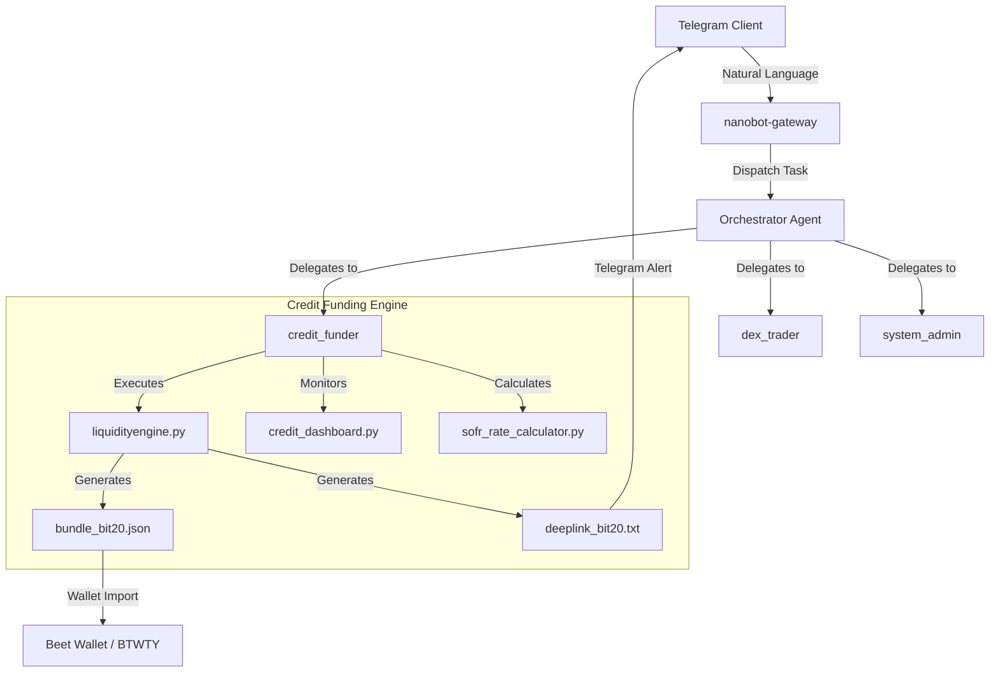

# 🐈 BoB v3 — BitShares Operations Bot

> **BOB** (BitShares Operations Bot) — orchestrator AI agent with Telegram integration, powered by [nanobot](https://github.com/HKUDS/nanobot) v0.2.1.
> Telegram handle: **@liquidityenginebot**

**v3** merges all BitShares capabilities from BOB-upgraded2 into the latest nanobot framework, gaining new upstream features (audio transcription, WebUI, enhanced tool system) while retaining all BitShares skills.

---

## Architecture



### Sub-Agents

| Sub-Agent | Triggered By | What It Does |
|---|---|---|
| `credit_funder` | "fund", "credit offer", "trade", "swap", "transfer" | Core operator — LP funding, DEX operations, pool routing, credit offers |
| `market_analyst` | "prices", "SOFR", "dashboard", "tradfi", "feed prices" | Market intelligence — Pyth prices, yield data, SOFR rate calculations |
| `system_admin` | "daemon", "tmux", "schedule", "memory", "file" | Daemon management, cron, memory, file ops |


---

## Prerequisites

| Requirement | Notes |
|---|---|
| Docker + Docker Compose | User must be in the `docker` group (`id` should show `docker`) |
| `~/.nanobot/config.json` | Deployed config — see [Configuration](#-configuration) |
| OpenRouter API key | Set in config |
| Telegram bot token | Set in config (`@liquidityenginebot`) |

---

## 🚀 Quick Start

### Option A: Docker Compose (Recommended)

```bash
cd /home/jrc/Downloads/Appimage/DECDEUS/Q4-Apps/BOB-v3

# Start BoB (Telegram goes live automatically)
docker compose up -d nanobot-gateway

# Confirm Telegram connected
docker compose logs --tail=20 nanobot-gateway
# Look for: telegram | bot @liquidityenginebot connected
```

BoB is now reachable on Telegram. The container restarts automatically on reboot (`restart: unless-stopped`).

### Option B: Local Virtual Environment (Development)

```bash
cd /home/jrc/Downloads/Appimage/DECDEUS/Q4-Apps/BOB-v3
python3 -m venv venv && source venv/bin/activate
pip install -e ".[dev]"

# Telegram Gateway
nanobot gateway

# Interactive CLI
nanobot agent
```

### Docker Compose Services

```
nanobot-gateway   ← BoB's main process (Telegram + all channels)
nanobot-api       ← OpenAI-compatible REST API (optional)
nanobot-cli       ← One-shot CLI access (profile: cli)
```

---

## 🛠️ Configuration

The deployed config lives at **`~/.nanobot/config.json`**. The source config is at `BOB-v3/config.json` — keep them in sync.

> [!IMPORTANT]
> Config changes do not hot-reload. After editing the source file, sync and restart:
> ```bash
> cp config.json ~/.nanobot/config.json
> docker compose restart nanobot-gateway
> ```

### Key Settings

```json
{
  "agents": {
    "defaults": {
      "model": "google/gemini-3-flash-preview",
      "workspace": "~/.bob/workspace",
      "timezone": "America/New_York",
      "isOrchestrator": true
    }
  },
  "providers": {
    "openrouter": {
      "apiKey": "sk-or-v1-...",
      "apiBase": "https://openrouter.ai/api/v1"
    }
  },
  "channels": {
    "telegram": {
      "enabled": true,
      "token": "YOUR_BOT_TOKEN",
      "allowFrom": ["*"]
    }
  }
}
```

### Restricting Telegram Access

Replace `"*"` with Telegram numeric user IDs:
```json
"allowFrom": ["395693317", "987654321"]
```
Find your ID by messaging `@userinfobot` on Telegram.

### Volume & File Locations

| Path (Host) | Path (Container) | Contents |
|---|---|---|
| `~/.nanobot/config.json` | `/home/nanobot/.nanobot/config.json` | Runtime configuration |
| `~/.bob/workspace/` | `/home/nanobot/.bob/workspace/` | Sessions, memory, output files |
| `~/.bob/workspace/sessions/` | — | Per-user conversation sessions |
| `~/.bob/workspace/memory/` | — | Long-term memory (`MEMORY.md`, `history.jsonl`) |
| `~/.bob/workspace/bundle_*.json` | — | Generated transaction bundles |
| `~/.bob/workspace/deeplink_*.txt` | — | Beet wallet deep links |
| `/app/nanobot/skills/` | — | Skill plugins (built into image) |

---

## 🏦 BitShares Skills

| Skill | Description |
|---|---|
| `credit-fund` | Credit Funding Engine — LP withdrawals → credit offer funding |
| `tradfi` | Market Intelligence — Pyth prices, straddle limit orders, feed prices |
| `bitshares-ops` | Blockchain operations — Transfer, DEX orders, Credit offers |
| `bitshares-lp` | Liquidity Pool yield tracking and APR calculation |
| `pool-router` | Multi-hop LP path routing between any two assets |

### Credit Funding Engine (`credit-fund`)

The core skill. Monitors credit offer balances and, when depleted, withdraws from a Liquidity Pool, performs multi-hop asset exchanges, and tops up the credit offer.

#### Standalone Execution

```bash
cd nanobot/skills/credit-fund
python liquidityengine.py --account bit20 --source-mode default_source --output-dir /home/nanobot/.bob/workspace
```

| Flag | Description |
|---|---|
| `--account <name>` | Account to process (`bit20`, `gringotts`, or `all`). Default: `bit20` |
| `--source <pool_id>` | Override fund source pool (e.g., `1.19.248`, `1.19.507`) |
| `--source-mode <mode>` | Headless source resolution: `default_source`, `detect`, or `legacy` |
| `--safety-factor <float>` | Collateral safety ratio (e.g. `1.5` = 150%) |
| `--fee-rate <rates>` | Daily interest in basis points (`20000` blanket, or `1.21.533:15000` per-offer) |
| `--output-dir <path>` | Output directory for signing envelopes and deep links |

#### Available Accounts

| Account Key | On-Chain Name | Manages |
|---|---|---|
| `bit20` | `bit20-operations-agent-01` | USDC (1.21.533) and USDT (1.21.542) credit offers |
| `gringotts` | `gringotts-wizarding-bank` | bitRUBLE (1.21.669) and IOB.XRP (1.21.670) credit offers |

#### SOFR Rate Calculator

Computes BitShares `fee_rate` from live SOFR benchmarks via the Pyth Network oracle.

$$\text{fee\_rate} = \left( \frac{\text{SOFR} \times \text{Multiplier}}{365} \right) \times 1{,}000{,}000$$

**Multiplier hierarchy:** Per-offer → Per-account → Global default (3.0×)

```bash
python sofr_rate_calculator.py              # Human-readable
python sofr_rate_calculator.py --json       # Machine-readable
python sofr_rate_calculator.py --multiplier 4.5  # Custom multiplier
```

#### Daemon Monitor

Polls every hour, triggers funding when monitored offers hit 0 balance. Hot-reloads `config.json` each cycle.

```bash
python daemon.py
```

#### Credit Dashboard

Read-only portfolio view of all tracked credit offers — total USD exposure, BTS/BTC collateral requirements.

```bash
python credit_dashboard.py               # BTS and BTC collateral totals
python credit_dashboard.py --json --quiet # Machine-readable
```

### Advanced Asset Mechanics

**BTWTY.EOS / XBTSX.WRAM Price:**

$$\text{Price}_{\text{normalized}} = \frac{\text{Raw BTWTY.EOS}}{\text{Raw XBTSX.WRAM}} \times 100$$

- `XBTSX.WRAM` precision: 2 units · `BTWTY.EOS` precision: 4 units

**STH Option:** Asset TWENTIX.BTSPOOL (`1.3.5773`) backed by Liquidity Pool `1.19.63`. Lock pathfinding to this pool when routing STH collateral.

### TradFi Market Intelligence (`tradfi`)

| Tool | Purpose |
|---|---|
| `tradfi_manager.py` | 20+ live asset prices from Pyth Network (crypto, ETFs, commodities) |
| `feed_price_manager.py` | BitShares feed prices and 7-day averages via Kibana |
| `price_index_manager.py` | Background daemon maintaining `recent_price_index.json` |
| `straddle.py` | Generates bundled BitShares limit orders straddling market price |

---

## 💬 Telegram Commands

Message BoB on Telegram with natural language:

| Command | What Happens |
|---|---|
| `"Generate a credit fund transaction for bit20"` | Triggers credit_funder → runs liquidity engine → returns bundle + deep link |
| `"Fund bit20 using pool 1.19.248"` | Explicitly sets the funding source pool |
| `"Swap 100 BTS for USD on the DEX"` | DEX trader places a limit order with auto-pricing |
| `"Create a BTS straddle with 2% spread and 10000 BTS size"` | Generates straddle limit orders |
| `"What are the current tradfi prices?"` | Fetches live market data from Pyth |
| `"What is the current status of the liquidity engine?"` | Status diagnostic — daemons, logs, balances |
| `"Remind me to check the credit offers in 2 hours"` | Registers a background timer notification |

---

## ⌨️ Docker Operations

```bash
# Start
docker compose up -d nanobot-gateway

# Stop (remove containers + networks)
docker compose down

# Stop (+ remove volumes)
docker compose down -v

# Restart (e.g. after config change)
docker compose restart nanobot-gateway

# Live logs
docker compose logs -f nanobot-gateway

# Rebuild after code changes
docker compose build nanobot-gateway
docker compose up -d nanobot-gateway

# Health check
docker ps --filter "name=nanobot-gateway"
curl http://127.0.0.1:18790/health

# CLI one-shot
docker compose run --rm nanobot-cli agent -m "Check BitShares pool 1.19.501"

# Interactive CLI
docker compose run --rm nanobot-cli agent
```

---

## 🔧 Troubleshooting

### Permission Denied (UID 1000 / Host Mismatch)
```bash
sudo chown -R $(id -u):$(id -g) ~/.nanobot ~/.bob
```

### Docker Socket Error
```bash
sudo usermod -aG docker $USER
# Log out and back in
```

### Gateway Crash-Looping (`allowFrom` Empty)
The Telegram channel requires `allowFrom` to be non-empty. Always set to `["*"]` or specific IDs.

### Bot Conflict (Error 409)
Another process is polling the same bot token. Kill other instances:
```bash
docker ps -a --filter "name=nanobot"
docker compose down
```

---

## 📚 Further Reading
* [Design Overview](./DESIGN_OVERVIEW.md)
* [Nanobot Framework Docs](./docs/README.md)
