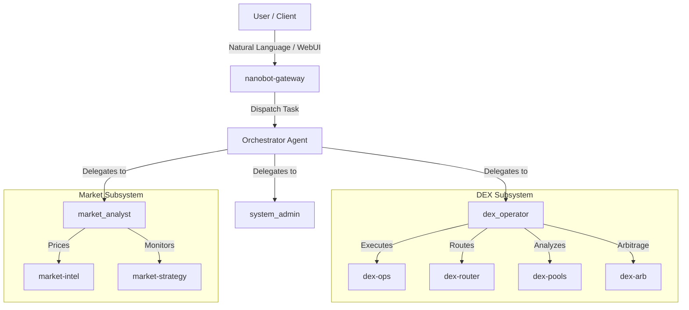

# 🐈 BitShares Operations Bot (BOB)

> **BOB** (BitShares Operations Bot) — AI-powered orchestrator for BitShares blockchain operations, automated trading, market intelligence, and WebUI management.

---

## Architecture



### Sub-Agents

| Sub-Agent | Triggered By | What It Does |
|---|---|---|
| `dex_operator` | "trade", "swap", "transfer", "limit order", "arbitrage", "ratio" | Core BitShares operator — transfers, DEX limit orders, pool routing, ratio arbitrage |
| `market_analyst` | "prices", "market data", "feed prices", "price index", "gold", "btc" | Market intelligence — Pyth Network prices, feed prices, price index maintenance |
| `system_admin` | "daemon", "tmux", "schedule", "memory", "cron", "file" | System administration, cron scheduling, long-term memory, file operations |

---

## Prerequisites

| Requirement | Notes |
|---|---|
| Python 3.11+ / Node.js 18+ / Bun | Python runtime and Node/Bun for WebUI build |
| Docker + Docker Compose | Containerized gateway deployment |
| `~/.nanobot/config.json` | Deployed runtime configuration |

---

## 🚀 Quick Start

### Option A: Local Virtual Environment (Development)

```bash
python3 -m venv .venv && source .venv/bin/activate
pip install -e ".[dev]"

# WebUI & Gateway Server
bob gateway

# Interactive CLI
bob agent
```

### Option B: Docker Compose

```bash
# Start BOB Gateway and REST API
docker compose up -d nanobot-gateway

# Confirm Gateway status
docker compose logs --tail=20 nanobot-gateway
```

---

## 🛠️ Configuration

The runtime config lives at **`~/.nanobot/config.json`**.

### Sample Configuration

```json
{
  "agents": {
    "defaults": {
      "model": "anthropic/claude-3-5-sonnet",
      "workspace": "~/.bob/workspace",
      "timezone": "America/New_York",
      "isOrchestrator": true
    }
  },
  "providers": {
    "anthropic": {
      "apiKey": "sk-ant-..."
    }
  },
  "channels": {
    "telegram": {
      "enabled": true,
      "token": "YOUR_BOT_TOKEN",
      "allowFrom": ["*"]
    }
  }
}
```

---

## 🏦 BitShares Skills

| Skill | Description |
|---|---|
| `dex-ops` | Blockchain operations — transfers, DEX limit orders, account queries |
| `dex-pools` | Liquidity pool yield tracking, pool statistics, TVL metrics |
| `dex-router` | Multi-hop LP path routing between assets |
| `dex-arb` | Cross-pool ratio arbitrage (BTWTY.BTC vs XBTSX.BTC equilibrium balancing) |
| `market-intel` | Market Intelligence — Pyth prices, feed prices, price index daemon |
| `market-strategy` | Autonomous strategy monitor — state collector, trigger engine |

---

## 💬 Command Examples

Natural language commands accepted via WebUI, CLI, or Telegram:

| Command | What Happens |
|---|---|
| `"Swap 100 BTS for USD on the DEX"` | Places DEX limit order with automated pricing |
| `"Calculate best swap route from BTWTY.BTC to BTS"` | Runs `dex-router` pathfinding |
| `"Check LP yield for pool 1.19.539"` | Runs `dex-pools` yield calculator |
| `"Check ratio arbitrage for BTWTY.BTC"` | Runs `dex-arb` ratio matcher |
| `"What are current market prices for Gold and BTC?"` | Fetches live market data from `market-intel` |

---

## ⌨️ Docker Operations

```bash
# Start Gateway
docker compose up -d nanobot-gateway

# Live logs
docker compose logs -f nanobot-gateway

# CLI interactive agent
docker compose run --rm nanobot-cli agent
```
